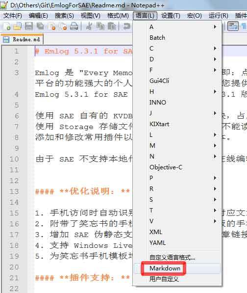

首先说明一点，Notepad++内置并不支持Markdown的语法。
先上一个效果图分为两个步骤  
 - [使Notepad++支持Makedown语法](#使notepad++支持makedown语法)

 - [使Notepad++支持Makedown预览](#使Notepad++支持Makedown预览)

效果图  

### 使Notepad++支持Makedown语法
1. 下载[Markdown规则文件](https://link.jianshu.com/?t=https://github.com/Edditoria/markdown_npp_zenburn/archive/master.zip) （百度云链接: http://pan.baidu.com/s/1dEAvrm5 密码: f2kd）。

2. 通过Notepad++中的 语言 -> 自定义语言格式 -> 导入xml文件(不换主题的话选择default——theme里的xml文件就可以了) ，重启Notepad++实现。  
ps：[git地址及其他主题预览](https://github.com/Edditoria/markdown-plus-plus)

### 使Notepad++支持Makedown预览
1. 下载[NppMarkdown插件](http://blog.gclxry.com/wp-content/uploads/2013/10/NppMarkdown_2.2015.12.3-1.zip) （百度云链接: http://pan.baidu.com/s/1eRTWdfc 密码: 973a）

2. 将dll复制到Notepad++安装目录的plugins目录下，重启软件。  
ps:也通过软件自带的Plugin Manager来查找可用插件，勾选安装（但我并没有找到）。

### 附
>1. 原回答：[Notepad++中支持Markdown](https://www.jianshu.com/p/69d749376d0a)；
2. Makedown语法git地址：[markdown-plus-plus](https://github.com/Edditoria/markdown-plus-plus)
3. Makedown预览原文：[写了一个Notepad++的markdown插件](http://blog.gclxry.com/%E5%86%99%E4%BA%86%E4%B8%80%E4%B8%AAnotepad%E7%9A%84markdown%E6%8F%92%E4%BB%B6/)

